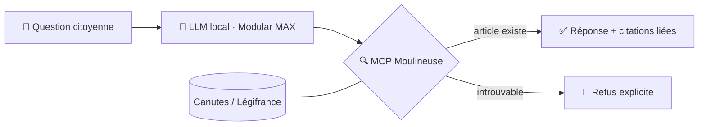

<div align="center">

# 🏛️ Le Rapporteur

### Zéro article inventé. Chaque citation vérifiée.

*L'assistant juridique citoyen qui refuse d'halluciner — Hackathon Assemblée nationale 2026*

[](#-prouvé-pas-promis)
[](#-architecture)
[](#-démarrage-rapide)
[](#-pitch-deck)

</div>

---

## 🎯 Le problème

Quand un citoyen pose une question de droit à une IA généraliste, il obtient une réponse
**convaincante… et parfois fausse**. Les LLM inventent des articles de loi et des
jurisprudences avec un aplomb parfait. En droit, une réponse fausse est **pire que pas de
réponse** — et le citoyen n'a aucun moyen de vérifier.

## 💡 La solution

**Le Rapporteur** ne cite que des textes qui existent. Comme le rapporteur parlementaire,
il travaille sur pièces :

1. **Génération contrainte** — un LLM open-weight servi **localement** par
   [`modular/max-openai-api`](https://hub.docker.com/r/modular/max-openai-api) (souverain, hors cloud)
2. **Vérification systématique** — chaque référence est résolue via
   **MCP Moulineuse** contre **[Canutes](https://db.code4code.eu/canutes/)** (droit consolidé Légifrance)
   et les schémas [Tricoteuses](https://parlement.tricoteuses.fr/docs)
3. **Réponse sourcée ou refus** — citations **cliquables vers le texte consolidé**, ou
   la réponse honnête : *« Je ne trouve pas de texte applicable. »*

## 🏗️ Architecture



| Brique | Rôle | Source |
|---|---|---|
| Modular MAX | Inférence LLM locale (API OpenAI-compatible) | `docker pull modular/max-openai-api` |
| MCP Moulineuse | Résolution & vérification des références juridiques | `tricoteuses.fr/services/mcp-moulineuse` |
| MCP Parlement | Données parlementaires (amendements, dossiers) | `tricoteuses.fr/services/mcp-parlement` |
| Canutes | Base du droit consolidé | `db.code4code.eu/canutes/` |
| Tricoteuses | Schémas AN / Sénat / Légifrance | `tricoteuses.fr/{assemblee,senat,legifrance}/schemas` |

## ✅ Prouvé, pas promis

La garantie anti-hallucination est **encodée en Gherkin** et rejouée en CI sur un
benchmark de questions citoyennes. **Un seul article fictif fait échouer le build.**

```gherkin
Scénario: Pas de citation inventée
  Étant donné une question citoyenne sur l'article X du code Y
  Quand le système répond
  Alors chaque article cité doit exister dans Canutes/Légifrance (vérif via MCP Moulineuse)
  Et si aucun texte applicable n'est trouvé, la réponse doit être un refus explicite
  Et aucune jurisprudence non présente dans les sources ne doit être mentionnée
```

## 🚀 Démarrage rapide

### POC (dans [poc/](poc/))

```bash
cd poc
python3 -m venv .venv && .venv/bin/pip install -r requirements.txt

# Tests Gherkin (le scénario du pitch, exécuté en vrai)
.venv/bin/behave

# Interface de démo (mode hors-ligne par défaut)
.venv/bin/uvicorn rapporteur.api:app --port 8080
# → http://localhost:8080
```

Le pipeline : `rapporteur/llm.py` (génération) → `rapporteur/citations.py`
(extraction) → `rapporteur/verifier.py` (vérification) → `rapporteur/pipeline.py`
(réponse sourcée ou refus).

**Mode live** (LLM local + MCP Moulineuse) :

```bash
# 1. Servir le modèle localement
docker pull modular/max-openai-api
docker run -p 8000:8000 modular/max-openai-api --model <modèle-open-weight>

# 2. Brancher le POC sur l'infra réelle
export RAPPORTEUR_MODE=live
export RAPPORTEUR_LLM_BASE_URL=http://localhost:8000/v1
export RAPPORTEUR_MCP_URL=https://mcp.hackathon2026.leximpact.dev/mcp
.venv/bin/uvicorn rapporteur.api:app --port 8080
```

## 🎤 Pitch deck

Le pitch de 3 minutes est un deck [Slidev](https://sli.dev) — les notes de présentation
minutées sont incluses dans chaque slide.

```bash
npm install
npm run dev      # présentation live (http://localhost:3030)
npm run export   # export PDF
```

## 🔭 Et demain

- **Aujourd'hui** : questions citoyennes sur les codes en vigueur
- **Demain** : outil pour les **services de l'AN** — vérification des références dans les
  amendements et les questions écrites
- **Après-demain** : brancher [Catala](https://catala-lang.org) pour des réponses
  *calculées* (law as code), pas seulement citées

---

<div align="center">

*La confiance dans le droit, ça ne s'improvise pas. **Ça se vérifie.***

</div>
