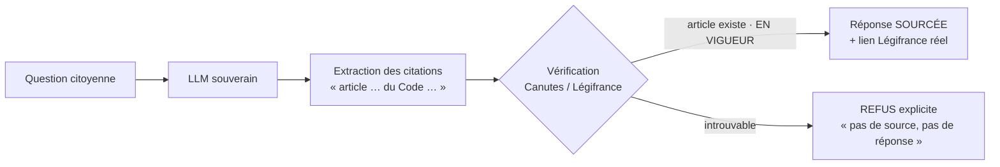
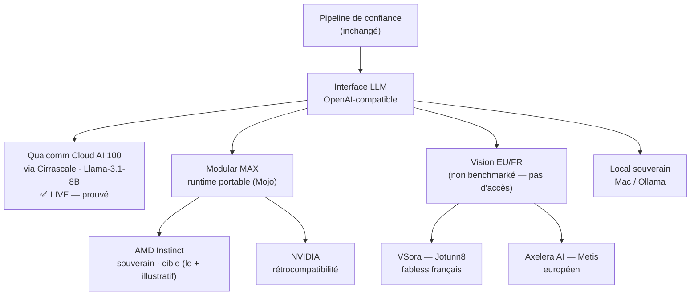

# Architecture & déploiement — Le Rapporteur

## 1. Pipeline de confiance (simplifié)

## 2. Déploiement du LLM — souveraineté hardware-agnostique
Le cœur : **une seule interface OpenAI-compatible**, plusieurs silicons. On change
`LLM_BASE_URL` → le même pipeline tourne ailleurs. C'est ça, la souveraineté
matérielle : ne dépendre d'aucun fournisseur unique (surtout pas CUDA/NVIDIA).

> Statuts honnêtes : **Qualcomm Cloud AI 100 = prouvé live**. AMD/NVIDIA via MAX =
> cible réaliste (MAX supporte ces GPU). VSora/Axelera = **vision** (pas d'accès,
> non mesuré). Rumeur Qualcomm×Modular = spéculation, non affirmée.

## 3. Qualcomm Cloud AI 100 — pourquoi ça compte (vulgarisation)
- **Ce que c'est** : un **accélérateur d'inférence dédié** (pas un GPU graphique
  détourné). Conçu pour *exécuter* des modèles déjà entraînés, pas pour les
  entraîner → beaucoup d'opérations par watt.
- **L'enjeu — perf/watt** : un datacenter IA, c'est d'abord une facture
  d'électricité. Un silicium d'inférence dédié fait le *même* travail (répondre à
  une question) pour **beaucoup moins d'énergie** qu'un GPU généraliste. Frugalité
  = souveraineté (moins de dépendance énergétique) + écologie.
- **L'enjeu — souveraineté** : aujourd'hui, faire tourner un LLM open-source rime
  de fait avec **NVIDIA/CUDA** (un seul fournisseur, US). Prouver que notre couche
  de confiance tourne **sans NVIDIA** (Qualcomm, demain AMD/EU) casse ce
  verrouillage. Le droit d'un pays ne devrait pas dépendre d'un seul vendeur de
  puces.
- **Le rôle de Modular MAX/Mojo** : la *couche de portabilité*. Écrire l'inférence
  une fois (Mojo), l'exécuter sur AMD, NVIDIA, Apple… → c'est ce qui rend les
  cibles souveraines (AMD, puis VSora/Axelera) réalistes.

## 4. Accès aux données — ce qu'on utilise VRAIMENT (honnête)
Trois voies existent vers Canutes/Légifrance ; voici lesquelles sont câblées.

| Voie | État réel | Où |
|---|---|---|
| **DB directe Canutes (PostgreSQL)** | ✅ **UTILISÉ** — cœur de la **vérification** (`legifrance.article`, num+code+VIGUEUR → lien LEGIARTI) | `src/data/canutes.py::verify_article` |
| **Serveur MCP (nous, fournisseur)** | ✅ **EXPOSÉ** — `repondre_question`, `verifier_article` : tout agent nous appelle | `poc/rapporteur/api.py::/mcp` |
| **Client MCP Moulineuse (SQL/JS)** | ⚙️ **disponible, pas dans le chemin live** (protocole OK, outil SQL à confirmer sur place) | `src/mcp/client.py` |
| **RAG / ancrage retrieval** | 🗺️ **roadmap** — la génération n'est PAS encore ancrée ; on fait *generate → verify* (fact-check a posteriori) | `src/pipeline.py::retrieve` (stub) |
| PostgREST public | ❌ inutile ici (n'expose que 3 tables) | — |

**En clair :** aujourd'hui on **génère puis on vérifie** chaque citation contre la
**DB Canutes en direct**, et on **expose un serveur MCP** (interopérabilité). Le
**RAG (ancrage amont)** est la prochaine étape — faisable via un `SELECT`
plein-texte Canutes (colonnes `text_search`) ou l'outil SQL de MCP Moulineuse.

> ⚠️ Cohérence pitch : la page `/details` (étape 1) parle d'« ancrage via MCP » —
> à aligner (soit on l'implémente, soit on reformule en « vérification »), sinon
> c'est un léger sur-discours devant un jury.

## Voir aussi
- [stack.md](stack.md) — la **stack complète d'un LLM** (modèle, moteur, langage GPU,
  silicium, cloud) avec souveraineté et environnement à chaque étage.
- [faq.md](faq.md) — questions techniques anticipées.

## Références
- Panorama des puces IA (paysage du silicium souverain) :
  <https://github.com/basicmi/AI-Chip>
- Détail schéma Canutes : [schema/README.md](schema/README.md) ·
  narratif : [pitch.md](pitch.md).
