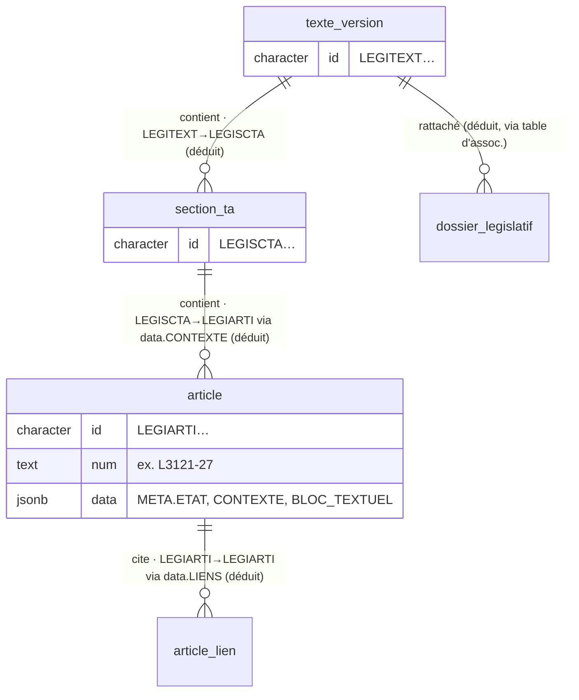

# Relations Canutes — ⚠️ DÉDUCTIONS (non déclarées en base)

> **Attention** : Canutes ne déclare **aucune clé étrangère**. Les relations
> ci-dessous sont **déduites** par convention d'identifiants Légifrance et par le
> contenu `jsonb` (`data.CONTEXTE`, `data.LIENS`). Ce sont des **hypothèses de
> lecture**, pas des contraintes vérifiées par le SGBD. À valider avant tout
> usage critique. (Version factuelle : [README.md](README.md).)

## Convention d'identifiants (fondement de la déduction)
Les `id` portent leur type en préfixe :
- `LEGIARTI…` = article · `LEGISCTA…` = section (nœud de l'arbre du code) ·
  `LEGITEXT…` = texte / code · `JORFARTI…` = version publiée au JO.

Un article référence sa section (`data.CONTEXTE` → `LEGISCTA`), la section
appartient à un texte (`LEGITEXT`), les articles se citent entre eux (`data.LIENS`).

## Diagramme (schéma `legifrance`, cœur) — déduit

## Pourquoi pas un DBML avec `Ref:` ?
Un `Ref:` DBML supposerait des **colonnes de jointure** réelles ; or ici la clé
étrangère « vit » **dans le `jsonb`** (`data.CONTEXTE`, `data.LIENS`), pas dans une
colonne. Émettre un `Ref:` sur des colonnes inexistantes serait **trompeur**.
Le diagramme Mermaid ci-dessus (déductif) est donc la forme honnête ; le DBML
factuel ([canutes.dbml](canutes.dbml)) reste, lui, sans relations.

## Méthode (si on veut étendre la déduction)
1. Convention de préfixe d'`id` (ci-dessus) — la plus fiable.
2. Parcours de `data.CONTEXTE` (arbre) et `data.LIENS` (cibles `LEGIARTI`).
3. Tables d'association explicites (ex.
   `texte_version_dossier_legislatif_assemblee_associations`).
Chaque lien déduit doit rester **étiqueté « déduction »** dans toute présentation.
