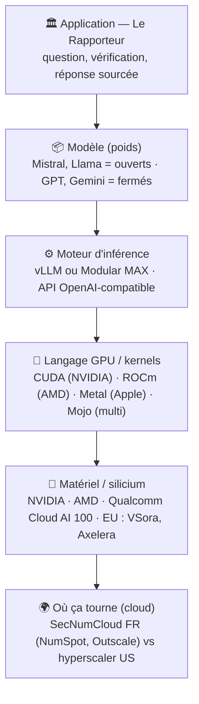

# La stack pour exécuter un LLM (souveraineté & environnement, étage par étage)

Avant de comparer les moteurs (vLLM, MAX), il faut voir **tout ce qu'il faut empiler**
pour faire tourner une IA. À chaque couche se joue un enjeu de **souveraineté /
géopolitique** et d'**environnement**. C'est là qu'on fait des choix.

## Le diagramme

## Le tableau (chaque couche = un choix)
| Couche | Exemples | Ouvert / fermé | Souveraineté & géopolitique | Environnement | Notre choix |
|---|---|---|---|---|---|
| **Modèle (poids)** | Mistral, Llama · GPT, Gemini | **ouvert** vs fermé | Poids ouverts = auto-hébergeable, pas d'API US imposée | Modèle compact/quantisé = moins de calcul | **Open-weight** (Mistral cible) |
| **Moteur d'inférence** | vLLM, Modular MAX | ouvert (les deux) | Interface OpenAI standard = **swappable**, pas de lock-in | Batching, efficacité du moteur | **Agnostique** (vLLM ou MAX) |
| **Langage GPU / kernels** | CUDA, ROCm, Metal, **Mojo** | CUDA = **propriétaire** ; ROCm/Mojo = ouverts | CUDA = **verrou NVIDIA (US)** ; Mojo = **neutre** (1 source → AMD/NVIDIA/Apple) | Kernels optimisés = moins de watts | **Mojo** (portable), pas lié à CUDA |
| **Matériel / silicium** | NVIDIA, AMD, Qualcomm Cloud AI 100, EU (VSora, Axelera) | matériel | Diversifier **hors NVIDIA** ; viser l'**EU** | **Accélérateur d'inférence dédié = 10–35× moins d'énergie** qu'un A100 (étude UCSD) | **Non-NVIDIA prouvé** (Qualcomm), AMD via MAX, vision EU |
| **Où ça tourne (cloud)** | NumSpot, Outscale, OVHcloud · AWS/Azure/GCP | infra | **SecNumCloud FR** vs Cloud Act US (juridiction, résidence) | Mutualisation, PUE du datacenter | **Cloud souverain** (roadmap) |

## Ce qui nous distingue : la souveraineté à *tous* les étages
La plupart des solutions cochent une ou deux cases. Nous visons la **cohérence de bout en bout** :
**modèle ouvert** → **moteur agnostique** → **pas de verrou CUDA** (Mojo) → **silicium non-NVIDIA
et frugal** → (roadmap) **cloud souverain**. Et une couche que personne d'autre ne met en avant :
la **confiance** (vérification en base, refus si pas de source, prouvée en Gherkin).

> Le débat « vLLM vs MAX » (cf. [faq.md](faq.md)) se situe **seulement à l'étage moteur/langage**.
> Notre message n'est pas « MAX est mieux », mais « on n'est **enfermés à aucun étage** ».
