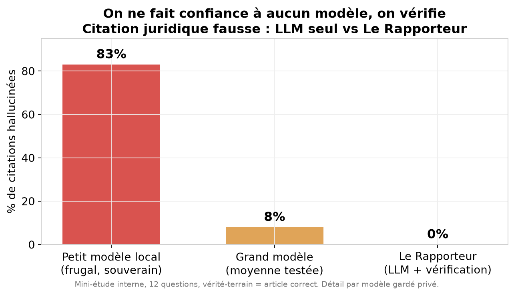

### Nom du défi
Le Rapporteur: une IA juridique de confiance qui vérifie, et refuse d'halluciner

### Description courte
Un assistant juridique pour les citoyens qui ne fait confiance à aucun modèle : chaque article de loi cité est vérifié dans les sources officielles (codes consolidés / Légifrance), et à défaut de source fiable, l'assistant refuse plutôt que d'inventer. Souverain et frugal : le même pipeline tourne d'un cloud français à un simple MacBook.

### Porteur
Équipe Le Rapporteur — Wilfred Doré & François Amat

### Description longue
**Le problème.** Les assistants à base de LLM citent des articles de loi avec aplomb, souvent faux. Un mauvais numéro d'article n'est pas une imprécision : il envoie le citoyen vers une norme qui ne le concerne pas. La littérature rapporte 58 à 88 % d'hallucination sur les requêtes juridiques.

**Notre réponse.** `question → génération LLM → extraction des citations → vérification dans les codes consolidés → réponse sourcée (lien Légifrance) OU refus explicite`. Design **fail-closed** : en cas de doute, on refuse.

**La vérification, en 4 couches (le cœur du projet) :**
1. **Index sur le numéro** d'article (recherche efficace des candidats).
2. **Match exact du code** par son identifiant stable Légifrance (CID), et non par simple `string.contains` — un « article 9 » existe dans des dizaines de codes.
3. **Pertinence ancrée par un LLM** : un vérificateur lit le **texte réel** de l'article (récupéré dans la base) et juge s'il **soutient la question**. C'est ce qui distingue un article réel mais hors-sujet (piège classique : citer l'article de définition au lieu de l'article de fond) d'une vraie source.
4. **Refus** si l'existence ou la pertinence échoue.

**Garanties exécutables.** Les invariants de confiance (zéro citation inexistante présentée ; refus si non vérifiable ; chaque citation renvoie à Légifrance) sont encodés dans une **fonction unique** utilisée au runtime, dans les tests (Gherkin, lisibles par un juriste) et dans l'interface. La confiance ne se décrète pas : elle s'exécute et se teste.

**Ce que notre benchmark révèle (et pourquoi ça compte).** Sur une étude de citations juridiques, la vérification d'**existence seule** laisse passer la majorité des erreurs (des articles réels mais hors-sujet, crédibilisés par un vrai lien). Il faut vérifier la **pertinence**. Et surtout : le petit modèle qu'on voudrait pour une inférence **locale et souveraine** hallucine le plus — donc la vérification n'est pas optionnelle, elle est **ce qui rend** une IA juridique frugale digne de confiance.

**Passage à l'échelle du benchmark.** Canutes contient 292 746 questions parlementaires du Sénat, et les questions écrites/orales de l'AN au Gouvernement figurent parmi les ressources : les réponses ministérielles citent les textes applicables, fournissant des paires question → articles de référence vérifiables — la voie pour étendre notre benchmark à n ≥ 100.

**Souveraineté & frugalité.** La couche de vérification est **agnostique** au modèle et au matériel. Le même pipeline tourne sur un cloud souverain français (Mistral La Plateforme), **100 % en local sur un MacBook** (Apple Silicon, sans NVIDIA) et sur des accélérateurs d'inférence dédiés — en changeant une seule variable d'environnement. On **expose aussi un serveur MCP** (`repondre_question`, `verifier_article`) : notre vérification est réutilisable par tout l'écosystème.

### Image principale

### Contributeurs
- Wilfred Doré
- François Amat

### Ressources utilisées
Cochez les ressources utilisées en remplaçant `[ ]` par `[x]`.

- [ ] `openfisca-france-parameters` — Base de données de paramètres ✺ OpenFisca
- [ ] `an-dossiers-legislatifs` — Dossiers législatifs de l'Assemblée nationale (législature courante) ✺ Assemblée nationale
- [ ] `an-amendements-xvii` — Amendements déposés à l'Assemblée nationale (législature actuelle) ✺ Assemblée nationale
- [ ] `an-comptes-rendus` — Comptes rendus de la séance publique à l'Assemblée nationale (législature actuelle) ✺ Assemblée nationale
- [ ] `an-votes-xvii` — Votes des députés (législature actuelle) ✺ Assemblée nationale
- [ ] `an-deputes-en-exercice` — Députés en exercice ✺ Assemblée nationale
- [ ] `an-deputes-historique` — Historique des députés ✺ Assemblée nationale
- [ ] `an-deputes-senateurs-ministres-par-legislature` — Députés, sénateurs et ministres d'une législature ✺ Assemblée nationale
- [ ] `an-agenda-reunions` — Agenda des réunions à l'Assemblée nationale (législature courante) ✺ Assemblée nationale
- [ ] `an-questions-gouvernement` — Questions de l'Assemblée nationale au Gouvernement ✺ Assemblée nationale
- [ ] `an-questions-gouvernement-ecrites` — Questions écrites de l'Assemblée nationale au Gouvernement ✺ Assemblée nationale
- [ ] `an-questions-gouvernement-orales` — Questions orales de l'Assemblée nationale au Gouvernement ✺ Assemblée nationale
- [x] `premier-ministre-legi` — Codes, lois et règlements consolidés ✺ Premier ministre
- [ ] `premier-ministre-dole` — Dossiers législatifs Légifrance ✺ Premier ministre
- [ ] `premier-ministre-jorf` — Édition ''Lois et décrets'' du Journal officiel ✺ Premier ministre
- [ ] `senat-dispositifs-textes` — Dispositifs des textes déposés ou adoptés au Sénat ✺ Sénat
- [ ] `senat-dossiers-legislatifs` — Dossiers législatifs du Sénat ✺ Sénat
- [ ] `senat-amendements` — Amendements déposés au Sénat ✺ Sénat
- [ ] `senat-senateurs` — Sénateurs ✺ Sénat
- [x] `senat-questions-gouvernement` — Questions orales et écrites du Sénat au Gouvernement ✺ Sénat
- [ ] `senat-comptes-rendus` — Comptes rendus de la séance publique au Sénat ✺ Sénat
- [x] `an-et-co-database-regroupement-toutes-donnees` — Base de données unifiée Parlement / Législation / Service Public ✺ Assemblée nationale & communauté
- [x] `an-et-co-serveur-mcp-regroupement-toutes-donnees` — Serveur MCP  - Accès unifié Parlement / Législation / Service Public ✺ Assemblée nationale & communauté
- [x] `an-et-co-api-regroupement-toutes-donnees` — API - Accès unifié Parlement / Législation / Service Public ✺ Assemblée nationale & communauté
- [ ] `legiwatch-api-parlement` — API Parlement ✺ LegiWatch
- [ ] `legiwatch-database-parlement` — Base de données Parlement ✺ LegiWatch
- [ ] `legiwatch-serveur-mcp-parlement` — Serveur MCP Parlement ✺ LegiWatch

### Galerie
- [On ne fait confiance à aucun modèle, on vérifie](images/image-1.png)
- [Kernel de calcul sur Apple Silicon (agnosticité matérielle)](images/image-2.png)
- [Frugalité de l'inférence (perf/watt)](images/image-3.png)
- [Portabilité : cloud souverain FR ↔ 100 % local sur Mac](images/image-4.png)
- [Hallucination par modèle (détail de l'étude)](images/image-5.png)
- [Cartographie du schéma Canutes (253 tables)](images/image-6-schema-canutes.svg)

### Documents
- [Article de recherche (draft) — benchmark d'hallucination de citations FR](docs/le-rapporteur-benchmark-hallucination.pdf)
- [Ressources exploitées (orga + apportées)](docs/ressources-exploitees.md)
- [Résultats de benchmark (méthodo + chiffres)](docs/benchmarks-results.md)
- [FAQ technique (vérification, souveraineté, frugalité)](docs/faq.md)

### URL de démonstration
https://wilfred-dore.github.io/hackathon-assemblee-2026/

### Diapositives de présentation
[Diapositives de présentation](https://wilfred-dore.github.io/hackathon-assemblee-2026/diapositives.pdf)
