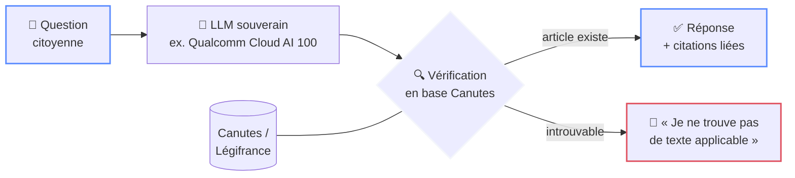
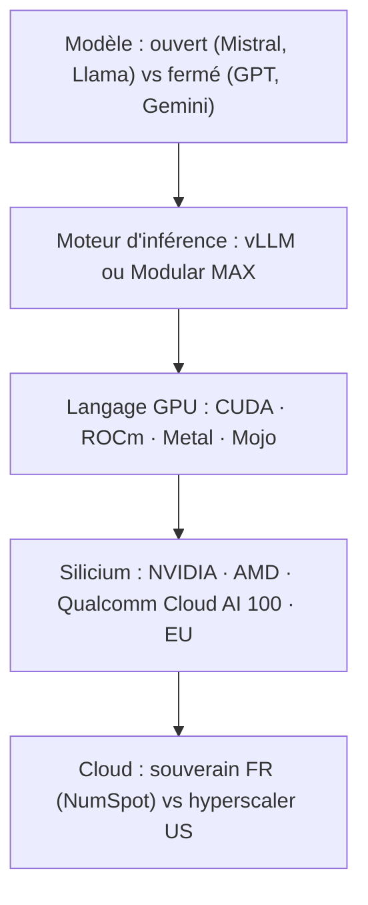
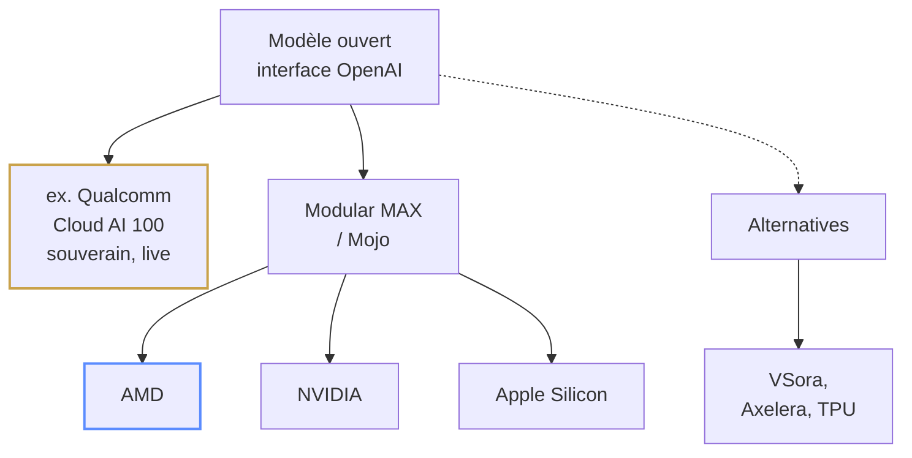

<div class="h-full flex flex-col items-center justify-center">

<div class="tricolore mb-8"><span></span><span></span><span></span></div>

<div class="kicker mb-4">Hackathon Assemblée nationale · 2026</div>

# Le Rapporteur

<div class="text-2xl mt-4 font-serif italic" style="color: var(--lr-gold)">
Zéro article inventé. Chaque citation vérifiée.
</div>

<div class="mt-6 text-base" style="color: var(--lr-muted)">
L'assistant juridique citoyen qui refuse d'halluciner
</div>

<div class="mt-8 text-sm tracking-wider" style="color: var(--lr-muted)">
François Amat · Wilfred Doré
</div>

</div>

<div class="foot"><span>LE RAPPORTEUR</span><span>PITCH · 3 MIN</span></div>

<!--
[0:00 – 0:20]
Bonjour. Quand un citoyen pose une question de droit à une IA générative, il obtient une réponse convaincante… et parfois fausse. Nous avons construit Le Rapporteur : un assistant qui ne cite QUE des textes qui existent.
-->

---
layout: two-cols
layoutClass: gap-10 items-center
---

<div class="kicker mb-2">01 · Constat</div>

# Le problème

<v-clicks>

- Les LLM généralistes **inventent des articles de loi** avec un aplomb parfait
- Des avocats ont déjà été sanctionnés pour des **jurisprudences fictives**
- Le citoyen n'a **aucun moyen de vérifier**
- En droit, une réponse fausse est **pire que pas de réponse**

</v-clicks>

::right::

<div class="halluc mt-10">

<div class="text-xs font-bold mb-3 tracking-widest" style="color: var(--lr-red)">❌ UNE IA GÉNÉRALISTE, AUJOURD'HUI</div>

<blockquote>
« Selon l'article <b>L. 4321-7 du Code du travail</b>, votre employeur doit… »
</blockquote>

<div class="mt-4 pt-3 text-sm border-t" style="border-color: rgba(224,74,88,0.3); color: var(--lr-muted)">
Cet article <b style="color: var(--lr-red)">n'existe pas</b>.<br>
Réponse plausible ≠ réponse vraie.
</div>

</div>

<div class="foot"><span>LE RAPPORTEUR</span><span>01 / LE PROBLÈME</span></div>

<!--
[0:20 – 0:50]
Le problème : les modèles génératifs sont des machines à plausibilité, pas à vérité. En droit, c'est dangereux. Un article inventé, une jurisprudence fictive, le citoyen ne peut pas vérifier.
-->

---
layout: center
class: text-center
---

<div class="kicker mb-2">02 · Réponse</div>

# La solution

<div class="text-xl mt-2 mb-8" style="color: var(--lr-muted)">
Un assistant qui <b>prouve</b> chaque citation, ou refuse de répondre
</div>



<div class="foot"><span>LE RAPPORTEUR</span><span>02 / LA SOLUTION</span></div>

<!--
[0:50 – 1:20]
Notre réponse : Le Rapporteur. Chaque article cité par le modèle est confronté à la base Canutes, le droit consolidé issu de Légifrance. Si l'article existe, on le cite avec un lien vers le texte réel. S'il n'existe pas : refus explicite. Pas de zone grise.
-->

---

<div class="kicker mb-2">03 · Architecture</div>

# Comment ça marche

<div class="grid grid-cols-3 gap-5 mt-10">

<div class="card accent-blue">
<div class="card-step">1</div>

### Génération souveraine

<p>Un LLM open source sur silicium souverain : <b>ex. Qualcomm Cloud AI 100</b> en direct, AMD via <b>Modular MAX</b> en cible. Hors NVIDIA.</p>
</div>

<div class="card accent-white">
<div class="card-step">2</div>

### Vérification en base

<p>Chaque référence confrontée à <b>Canutes / Légifrance</b> en direct : existe, dans ce code, en vigueur. On expose aussi un <b>serveur MCP</b>.</p>
</div>

<div class="card accent-red">
<div class="card-step">3</div>

### Réponse sourcée

<p>Citations <b>cliquables vers le texte consolidé</b>, ou refus honnête si rien ne s'applique.</p>
</div>

</div>

<div class="mt-10 text-center text-sm" style="color: var(--lr-muted)">
Données <b>Tricoteuses</b> (assemblée · sénat · légifrance) &nbsp;·&nbsp; Backend <b>OpenAI-compatible</b>, swappable
</div>

<div class="foot"><span>LE RAPPORTEUR</span><span>03 / ARCHITECTURE</span></div>

<!--
[1:20 – 1:50]
Trois briques : un modèle ouvert servi sur silicium souverain (ex. Qualcomm Cloud AI 100 en direct, AMD via Modular MAX en cible), la vérification systématique en base Canutes, et une interface qui lie chaque phrase à sa source consolidée.
-->

---
layout: two-cols
layoutClass: gap-10 items-center
---

<div class="kicker mb-2">04 · Preuve</div>

# Prouvé,<br>pas promis

<div class="mt-4 text-sm" style="color: var(--lr-muted)">
La garantie anti-hallucination est <b>encodée en Gherkin</b>, rejouée en CI sur un benchmark de questions citoyennes.
</div>

<v-click>

<div class="grid grid-cols-3 gap-3 mt-8">
<div class="stat"><div class="stat-value">100 %</div><div class="stat-label">citations vérifiées</div></div>
<div class="stat"><div class="stat-value">0</div><div class="stat-label">article fictif toléré</div></div>
<div class="stat"><div class="stat-value">« Je ne<br>sais pas »</div><div class="stat-label">est une réponse valide</div></div>
</div>

</v-click>

::right::

```gherkin
Scénario: Pas de citation inventée
  Étant donné une question citoyenne
    sur l'article X du code Y
  Quand le système répond
  Alors chaque article cité doit exister
    dans Canutes / Légifrance
    (vérification en base)
  Et si aucun texte applicable n'est trouvé,
    la réponse doit être un refus explicite
  Et aucune jurisprudence absente des
    sources ne doit être mentionnée
```

<div class="foot"><span>LE RAPPORTEUR</span><span>04 / PREUVE</span></div>

<!--
[1:50 – 2:15]
On ne vous demande pas de nous croire : le critère du jury, fiable, est encodé en scénarios Given/When/Then, rejoués automatiquement sur un benchmark de questions citoyennes. Un seul article fictif fait échouer le build.
-->

---
layout: two-cols
layoutClass: gap-10
---

<div class="kicker mb-2">05 · Critères</div>

# Fiable · Frugal · Portable

<v-clicks>

- **Fiable**, vérification systématique, refus explicite, benchmark reproductible
- **Frugal**, modèle compact quantisé, une requête MCP par citation
- **Portable**, `docker pull` et c'est parti : AN, préfecture, mairie

</v-clicks>

::right::

<div class="kicker mb-2">Et demain</div>

# Vision

<v-clicks>

- **Aujourd'hui**, questions citoyennes sur les codes en vigueur
- **Demain**, un produit pour les **services de l'AN** : vérifier les références des amendements et questions écrites
- **Après-demain**, brancher **Catala** : des réponses *calculées*, pas seulement citées

</v-clicks>

<div class="foot"><span>LE RAPPORTEUR</span><span>05 / CRITÈRES & VISION</span></div>

<!--
[2:15 – 2:45]
Le Rapporteur coche les trois critères : fiable par construction, frugal par design, portable en un conteneur. Et c'est un produit dont un service de l'Assemblée a besoin dès maintenant : la même vérification s'applique aux références dans les amendements.
-->

---

<div class="kicker mb-2">Comprendre · la stack IA</div>

# Tout ce qu'il faut pour exécuter une IA

<div class="text-sm" style="color: var(--lr-muted)">
À chaque étage se joue la souveraineté et l'environnement. C'est là qu'on fait nos choix.
</div>



<div class="text-sm mt-4 text-center" style="color: var(--lr-muted)">
Notre parti pris : <b>souverain à tous les étages</b> : ouvert, moteur agnostique, sans verrou CUDA, silicium non-NVIDIA et frugal.
</div>

<div class="foot"><span>LE RAPPORTEUR</span><span>LA STACK IA</span></div>

<!--
[Aparté stack] Avant de parler puce ou moteur, voyons tout ce qu'il faut empiler pour faire tourner une IA : le modèle, le moteur d'inférence, le langage qui programme le GPU, le silicium, et le cloud où ça tourne. À chaque étage, un enjeu de souveraineté et d'énergie. Notre parti pris : être souverain à tous les étages.
-->

---
layout: two-cols
layoutClass: gap-10 items-center
---

<div class="kicker mb-2">06 · Souveraineté</div>

# Sans verrou NVIDIA

<div class="mt-4 text-sm" style="color: var(--lr-muted)">
Un <b>modèle ouvert</b> (Mistral, Llama) derrière une interface OpenAI-compatible.
On change de backend, le pipeline ne bouge pas. Servir un LLM open source rime aujourd'hui
avec NVIDIA et CUDA. Nous le prouvons autrement.
</div>

<v-clicks>

- <b style="color: var(--lr-gold)">Prouvé en direct</b> : swap <b>Qualcomm Cloud AI 100</b> ⇄ <b>Mistral La Plateforme 🇫🇷</b>, sans toucher au pipeline
- <b>Modular MAX / Mojo</b> : le même code sur <b>AMD</b>, <b>NVIDIA</b>, <b>Apple Silicon</b> (démontrable en local) ; puces EU en vision (VSora, Axelera)
- <b>On vérifie quel que soit le modèle</b> : le garde-fou ne dépend d'aucun LLM

</v-clicks>

::right::



<div class="foot"><span>LE RAPPORTEUR</span><span>06 / SOUVERAINETÉ MATÉRIELLE</span></div>

<!--
[Souveraineté] Notre couche de confiance est indépendante du fournisseur de puce ET du modèle. On le prouve en direct : le même pipeline tourne sur Qualcomm Cloud AI 100 et sur Mistral La Plateforme, souverain français, en changeant une seule variable d'environnement. Modular MAX et Mojo portent l'inférence sur AMD, NVIDIA et Apple Silicon, démontrable sur un simple MacBook. Puces souveraines européennes en vision : VSora, Axelera. Et surtout : on vérifie quel que soit le modèle, le garde-fou ne dépend d'aucun LLM. Observation à confirmer par notre benchmark : le modèle souverain français tend à être plus juste sur le droit français, un avantage de souveraineté supplémentaire, mais on ne s'y fie pas, on vérifie. La rumeur d'un rapprochement Qualcomm et Modular reste une spéculation, nous ne l'affirmons pas.
-->

---
layout: two-cols
layoutClass: gap-10 items-center
---

<div class="kicker mb-2">07 · Performance & frugalité</div>

# Chaque watt compte

<div class="mt-4 text-sm" style="color: var(--lr-muted)">
Un datacenter d'IA, c'est d'abord une facture d'électricité. Une puce d'inférence
dédiée fait le même travail pour bien moins d'énergie qu'un GPU généraliste.
</div>

<v-click>

<div class="grid grid-cols-3 gap-3 mt-8">
<div class="stat"><div class="stat-value">10–35×</div><div class="stat-label">moins d'énergie qu'un A100 (LLM open source, étude UCSD)</div></div>
<div class="stat"><div class="stat-value">dédié</div><div class="stat-label">accélérateur d'inférence, pas un GPU détourné</div></div>
<div class="stat"><div class="stat-value">perf / watt</div><div class="stat-label">souveraineté et écologie</div></div>
</div>

</v-click>

<div class="mt-6 text-sm" style="color: var(--lr-muted)">
Validation externe : une <b>étude UCSD</b> (arXiv 2507.00418) mesure 10 à 35× moins
d'énergie sur Qualcomm Cloud AI 100 Ultra vs A100, pour 12 LLM open source. On voulait
benchmarker ce cas d'usage nous-mêmes ; un hackathon, c'est des arbitrages de temps assumés.
À la démo : latence et débit en direct.
</div>

::right::

<div class="card accent-blue">
<div class="text-xs font-bold mb-3 tracking-widest" style="color: var(--lr-gold)">MODULAR MAX & MOJO</div>

<p>La couche de <b>portabilité</b> : écrire l'inférence une fois, l'exécuter sur
AMD, NVIDIA, Apple. C'est ce qui rend les cibles souveraines réalistes.</p>

<p class="mt-3 text-sm" style="color: var(--lr-muted)">Un hot path en <b>Mojo</b>,
benchmarké contre Python, alimente le panneau de frugalité.</p>
</div>

<div class="foot"><span>LE RAPPORTEUR</span><span>07 / PERFORMANCE</span></div>

<!--
[Performance] Un datacenter d'IA, c'est une facture d'électricité avant tout. Une puce d'inférence dédiée comme le ex. Qualcomm Cloud AI 100 fait le même travail pour beaucoup moins de watts qu'un GPU généraliste. Frugalité égale souveraineté plus écologie. Modular MAX est la couche de portabilité, et Mojo permet d'optimiser les points chauds. On mesure la latence et le débit en direct ; le benchmark AMD contre NVIDIA est notre prochaine étape.
-->

---

<div class="kicker mb-2">07b · Benchmarks mesurés</div>

# Mesuré sur un MacBook, pas promis

<div class="mt-2 text-sm" style="color: var(--lr-muted)">
Le <b>même pipeline</b>, trois backends souverains, échangés par une seule variable
d'environnement. Latence et débit <b>réels</b> sur un M2 Pro.
</div>

<div class="mt-3 flex justify-center">

</div>

<div class="mt-3 text-sm" style="color: var(--lr-muted)">
Sur la même question, les trois modèles ont <b style="color: var(--lr-gold)">inventé</b>
un numéro d'article (Ollama : L.3121-1 ; Qualcomm/Llama : L.3122-2 ; le bon est
L.3121-27). <b>On ne fait confiance à aucun modèle, on vérifie.</b>
</div>

<div class="foot"><span>LE RAPPORTEUR</span><span>07B / BENCHMARKS</span></div>

<!--
[Benchmarks] Tout ce qu'on montre ici, on l'a mesuré ce matin sur un simple MacBook M2 Pro. Le même pipeline tourne sur Mistral La Plateforme souverain français, sur un Mistral 7B 100% local via Ollama, et sur Qualcomm Cloud AI 100, juste en changeant une variable d'environnement. Et le point le plus important : sur la même question, les trois modèles ont inventé un numéro d'article de loi. C'est exactement ce que notre couche de vérification attrape. On ne fait confiance à aucun modèle, on vérifie.
-->

---

<div class="kicker mb-2">08 · Ce qu'on apporte en plus</div>

# Un outil, pas seulement une démo

<div class="grid grid-cols-3 gap-5 mt-10">

<div class="card accent-blue">
<div class="card-step">A</div>

### Serveur MCP

<p>Le Rapporteur <b>expose</b> <code>repondre_question</code> et <code>verifier_article</code> : tout agent peut brancher notre <b>vérification juridique</b></p>
</div>

<div class="card accent-white">
<div class="card-step">B</div>

### Vérification en base

<p>Article confronté à <b>Canutes / Légifrance</b> en direct : existe, dans ce code, <b>en vigueur</b>, lien cliquable</p>
</div>

<div class="card accent-red">
<div class="card-step">C</div>

### Carte du schéma

<p>Cartographie de Canutes <b>lisible par les IA</b> (JSON, DBML, SchemaSpy), reversable à Tricoteuses</p>
</div>

</div>

<div class="mt-10 text-center text-sm" style="color: var(--lr-muted)">
On vérifie par la voie la plus <b>directe et déterministe</b> (la base Canutes elle-même),
et on <b>expose cette vérification en MCP</b> pour que tout l'écosystème puisse la réutiliser.
</div>

<div class="foot"><span>LE RAPPORTEUR</span><span>08 / CE QU'ON APPORTE</span></div>

<!--
[Contribution] Au delà de la démo, on livre trois choses réutilisables. Un : Le Rapporteur est lui même un serveur MCP, n'importe quel agent peut appeler notre vérification. Deux : la vérification tape la base Canutes en direct, article en vigueur, lien Légifrance réel. Trois : on a cartographié le schéma de Canutes, lisible par une IA, reversable au projet Tricoteuses. On ne consomme pas seulement des données, on devient une brique de confiance.
-->

---
layout: two-cols
layoutClass: gap-10
---

<div class="kicker mb-2">09 · Roadmap</div>

# Ce qui tourne, ce qui vient

<div class="text-xs font-bold mb-2 tracking-widest" style="color: var(--lr-gold)">DÉJÀ EN PLACE</div>

<v-clicks>

- Vérification en base réelle, refus explicite, preuve Gherkin
- Backend souverain en direct (ex. Qualcomm Cloud AI 100)
- Serveur MCP, API de fact-check, carte du schéma Canutes

</v-clicks>

::right::

<div class="text-xs font-bold mb-2 tracking-widest" style="color: var(--lr-muted)">À VENIR</div>

<v-clicks>

- **RAG** : ancrer le contenu, pas seulement la citation (recherche plein-texte Canutes ou MCP Moulineuse)
- **Mistral en direct** via Modular MAX sur AMD
- **Benchmark perf / watt** AMD contre NVIDIA, hot path **Mojo**
- Unifier le **serveur MCP** sur le moteur de vérification live

</v-clicks>

<div class="foot"><span>LE RAPPORTEUR</span><span>09 / ROADMAP</span></div>

<!--
[Roadmap] Soyons transparents sur l'état. Ce qui tourne aujourd'hui : la vérification en base réelle, le refus explicite, la preuve Gherkin, le backend souverain ex. Qualcomm Cloud AI 100 en direct, le serveur MCP et la carte du schéma. Ce qui vient : le RAG pour ancrer le contenu et pas seulement la citation, Mistral en direct via Modular MAX sur AMD, le benchmark performance par watt entre AMD et NVIDIA avec un noyau Mojo, et l'unification du serveur MCP sur notre moteur de vérification.
-->

---
layout: center
class: text-center
---

<div class="tricolore mb-8"><span></span><span></span><span></span></div>

# Le Rapporteur

<div class="text-2xl mt-4 font-serif italic leading-relaxed">
La confiance dans le droit, ça ne s'improvise pas.<br>
<b>Ça se vérifie.</b>
</div>

<div class="mt-12 flex justify-center gap-10 text-xs tracking-wider" style="color: var(--lr-muted)">
<div>François Amat · Wilfred Doré</div>
<div>wilfred-dore.github.io/hackathon-assemblee-2026</div>
</div>

<!--
[2:45 – 3:00]
Le Rapporteur : zéro article inventé, chaque citation vérifiée. Merci, et maintenant, la démo.
-->
