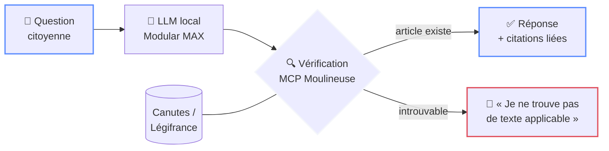

<div class="h-full flex flex-col items-center justify-center">

<div class="tricolore mb-8"><span></span><span></span><span></span></div>

<div class="kicker mb-4">Hackathon Assemblée nationale · 2026</div>

# Le Rapporteur

<div class="text-2xl mt-4 font-serif italic" style="color: var(--lr-gold)">
Zéro article inventé. Chaque citation vérifiée.
</div>

<div class="mt-6 text-base" style="color: var(--lr-muted)">
L'assistant juridique citoyen qui refuse d'halluciner
</div>

</div>

<div class="foot"><span>LE RAPPORTEUR</span><span>PITCH · 3 MIN</span></div>

<!--
[0:00 – 0:20]
Bonjour. Quand un citoyen pose une question de droit à une IA générative, il obtient une réponse convaincante… et parfois fausse. Nous avons construit Le Rapporteur : un assistant qui ne cite QUE des textes qui existent.
-->

---
layout: two-cols
layoutClass: gap-10 items-center
---

<div class="kicker mb-2">01 · Constat</div>

# Le problème

<v-clicks>

- Les LLM généralistes **inventent des articles de loi** avec un aplomb parfait
- Des avocats ont déjà été sanctionnés pour des **jurisprudences fictives**
- Le citoyen n'a **aucun moyen de vérifier**
- En droit, une réponse fausse est **pire que pas de réponse**

</v-clicks>

::right::

<div class="halluc mt-10">

<div class="text-xs font-bold mb-3 tracking-widest" style="color: var(--lr-red)">❌ UNE IA GÉNÉRALISTE, AUJOURD'HUI</div>

<blockquote>
« Selon l'article <b>L. 4321-7 du Code du travail</b>, votre employeur doit… »
</blockquote>

<div class="mt-4 pt-3 text-sm border-t" style="border-color: rgba(224,74,88,0.3); color: var(--lr-muted)">
Cet article <b style="color: var(--lr-red)">n'existe pas</b>.<br>
Réponse plausible ≠ réponse vraie.
</div>

</div>

<div class="foot"><span>LE RAPPORTEUR</span><span>01 / LE PROBLÈME</span></div>

<!--
[0:20 – 0:50]
Le problème : les modèles génératifs sont des machines à plausibilité, pas à vérité. En droit, c'est dangereux. Un article inventé, une jurisprudence fictive — le citoyen ne peut pas vérifier.
-->

---
layout: center
class: text-center
---

<div class="kicker mb-2">02 · Réponse</div>

# La solution

<div class="text-xl mt-2 mb-8" style="color: var(--lr-muted)">
Un assistant qui <b>prouve</b> chaque citation — ou refuse de répondre
</div>



<div class="foot"><span>LE RAPPORTEUR</span><span>02 / LA SOLUTION</span></div>

<!--
[0:50 – 1:20]
Notre réponse : Le Rapporteur. Chaque article cité par le modèle passe par le MCP Moulineuse et la base Canutes — le droit consolidé issu de Légifrance. Si l'article existe, on le cite avec un lien vers le texte réel. S'il n'existe pas : refus explicite. Pas de zone grise.
-->

---

<div class="kicker mb-2">03 · Architecture</div>

# Comment ça marche

<div class="grid grid-cols-3 gap-5 mt-10">

<div class="card accent-blue">
<div class="card-step">1</div>

### Génération contrainte

<p>LLM <b>open-weight local</b> servi par <code>modular/max-openai-api</code> — souverain, hors cloud</p>
</div>

<div class="card accent-white">
<div class="card-step">2</div>

### Vérification MCP

<p>Chaque référence résolue via <b>MCP Moulineuse</b> contre <b>Canutes</b> et les schémas Tricoteuses</p>
</div>

<div class="card accent-red">
<div class="card-step">3</div>

### Réponse sourcée

<p>Citations <b>cliquables vers le texte consolidé</b> — ou refus honnête si rien ne s'applique</p>
</div>

</div>

<div class="mt-10 text-center text-sm" style="color: var(--lr-muted)">
Données <b>Tricoteuses</b> (assemblée · sénat · légifrance) &nbsp;·&nbsp; Infra : <b>un seul conteneur Docker</b>
</div>

<div class="foot"><span>LE RAPPORTEUR</span><span>03 / ARCHITECTURE</span></div>

<!--
[1:20 – 1:50]
Trois briques, toutes issues de l'écosystème du hackathon : un modèle ouvert servi localement par Modular MAX, la vérification systématique via MCP Moulineuse sur Canutes, et une interface qui lie chaque phrase à sa source consolidée.
-->

---
layout: two-cols
layoutClass: gap-10 items-center
---

<div class="kicker mb-2">04 · Preuve</div>

# Prouvé,<br>pas promis

<div class="mt-4 text-sm" style="color: var(--lr-muted)">
La garantie anti-hallucination est <b>encodée en Gherkin</b>, rejouée en CI sur un benchmark de questions citoyennes.
</div>

<v-click>

<div class="grid grid-cols-3 gap-3 mt-8">
<div class="stat"><div class="stat-value">100 %</div><div class="stat-label">citations vérifiées</div></div>
<div class="stat"><div class="stat-value">0</div><div class="stat-label">article fictif toléré</div></div>
<div class="stat"><div class="stat-value">« Je ne<br>sais pas »</div><div class="stat-label">est une réponse valide</div></div>
</div>

</v-click>

::right::

```gherkin
Scénario: Pas de citation inventée
  Étant donné une question citoyenne
    sur l'article X du code Y
  Quand le système répond
  Alors chaque article cité doit exister
    dans Canutes/Légifrance
    (vérification via MCP Moulineuse)
  Et si aucun texte applicable n'est trouvé,
    la réponse doit être un refus explicite
  Et aucune jurisprudence absente des
    sources ne doit être mentionnée
```

<div class="foot"><span>LE RAPPORTEUR</span><span>04 / PREUVE</span></div>

<!--
[1:50 – 2:15]
On ne vous demande pas de nous croire : le critère du jury — fiable — est encodé en scénarios Given/When/Then, rejoués automatiquement sur un benchmark de questions citoyennes. Un seul article fictif fait échouer le build.
-->

---
layout: two-cols
layoutClass: gap-10
---

<div class="kicker mb-2">05 · Critères</div>

# Fiable · Frugal · Portable

<v-clicks>

- **Fiable** — vérification systématique, refus explicite, benchmark reproductible
- **Frugal** — modèle compact quantisé, une requête MCP par citation
- **Portable** — `docker pull` et c'est parti : AN, préfecture, mairie

</v-clicks>

::right::

<div class="kicker mb-2">Et demain</div>

# Vision

<v-clicks>

- **Aujourd'hui** — questions citoyennes sur les codes en vigueur
- **Demain** — un produit pour les **services de l'AN** : vérifier les références des amendements et questions écrites
- **Après-demain** — brancher **Catala** : des réponses *calculées*, pas seulement citées

</v-clicks>

<div class="foot"><span>LE RAPPORTEUR</span><span>05 / CRITÈRES & VISION</span></div>

<!--
[2:15 – 2:45]
Le Rapporteur coche les trois critères : fiable par construction, frugal par design, portable en un conteneur. Et c'est un produit dont un service de l'Assemblée a besoin dès maintenant : la même vérification s'applique aux références dans les amendements.
-->

---
layout: center
class: text-center
---

<div class="tricolore mb-8"><span></span><span></span><span></span></div>

# Le Rapporteur

<div class="text-2xl mt-4 font-serif italic leading-relaxed">
La confiance dans le droit, ça ne s'improvise pas.<br>
<b>Ça se vérifie.</b>
</div>

<div class="mt-12 flex justify-center gap-10 text-xs tracking-wider" style="color: var(--lr-muted)">
<div>mcp.hackathon2026.leximpact.dev</div>
<div>db.code4code.eu/canutes</div>
<div>parlement.tricoteuses.fr</div>
</div>

<!--
[2:45 – 3:00]
Le Rapporteur : zéro article inventé, chaque citation vérifiée. Merci — et maintenant, la démo.
-->
